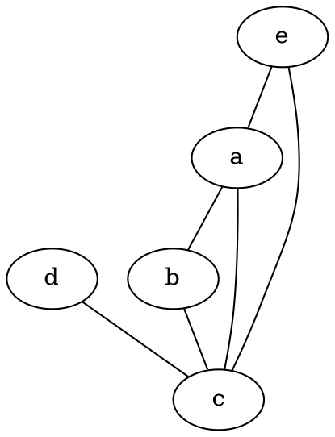
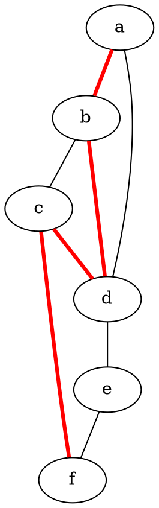
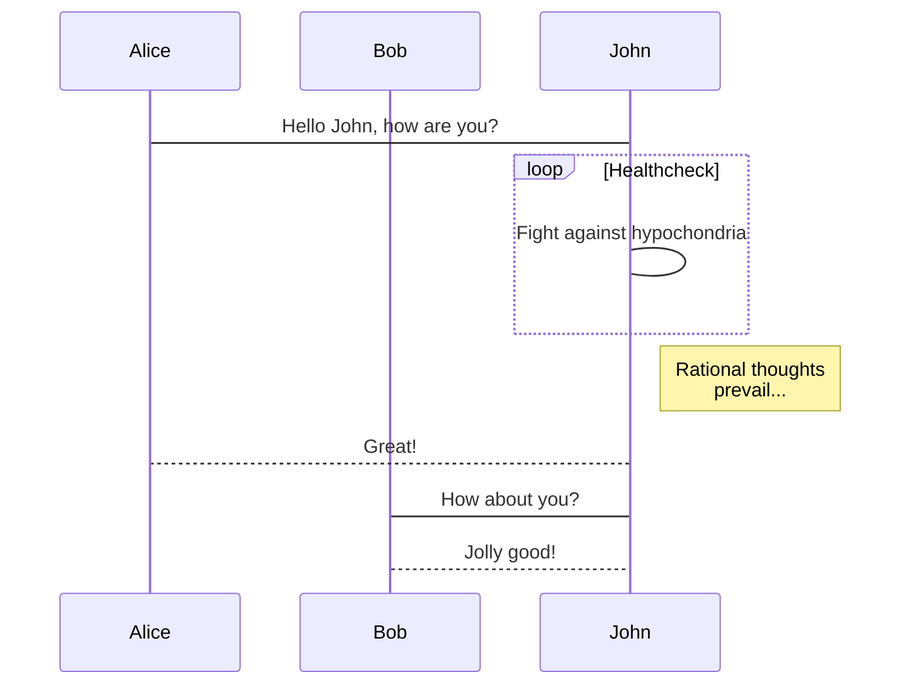

## GraphViz

    ```dot-svg
    graph {
        a -- b;
        b -- c;
        a -- c;
        d -- c;
        e -- c;
        e -- a;
    }
    ```



    ```dot-svg
    graph {
        a -- b[color=red,penwidth=3.0];
        b -- c;
        c -- d[color=red,penwidth=3.0];
        d -- e;
        e -- f;
        a -- d;
        b -- d[color=red,penwidth=3.0];
        c -- f[color=red,penwidth=3.0];
    }
    ```



## Bob

    ```bob-svg
    o->  It can do complex stuff such as circuit diagrams


        +10-15V           ___0,047R
        *------o------o-|___|-o--o---------o----o-------.
                |      |       |  |         |    |       |
                ---     |       | .+.        |    |       |
        470uF ###     |       | | | 2k2    |    |       |
                | +    |       | | |        |    |      .+.
        *------o      '--.    | '+'       .+.   |      '-'
                |         |6   |7 |8    1k | |   |       |
                GND      .-+----+--+--.     | |   |       |
                        |            |     '+'   |       |
                        |            |1     |  |/  BC    |
                        |            +------o--+   547   |
                        |            |      |  |`>       |
                        |            |     ,+.   |       |
                        |            | 220R| |   o----||-+  IRF9Z34
                        |            |     | |   |    |+->
                        |  MC34063   |     `+'   |    ||-+
                        |            |      |    |       |  BYV29     -12V6
                        |            |      '----'       o--|<-o----o--X OUT
                        |            |2                  |     |    |
                        |            |--o                C|    |    |
                        |            | GND         30uH  C|    |   --- 470
                        |            |3      1nF         C|    |   ###  uF
                        |            |-------||--.       |     |    | +
                        '-----+----+-'           |      GND    |   GND
                            5|   4|             |             |
                            |    '-------------o-------------o
                            |                           ___  |
                            '------/\/\/------------o--|___|-'
                                                    |       1k0
                                                    .+.
                                                    | | 5k6 + 3k3
                                                    | | in Serie
                                                    '+'
                                                    |
                                                    GND
    ```

```bob-svg
o->  It can do complex stuff such as circuit diagrams


     +10-15V           ___0,047R
      *------o------o-|___|-o--o---------o----o-------.
             |      |       |  |         |    |       |
            ---     |       | .+.        |    |       |
      470uF ###     |       | | | 2k2    |    |       |
             | +    |       | | |        |    |      .+.
      *------o      '--.    | '+'       .+.   |      '-'
             |         |6   |7 |8    1k | |   |       |
            GND      .-+----+--+--.     | |   |       |
                     |            |     '+'   |       |
                     |            |1     |  |/  BC    |
                     |            +------o--+   547   |
                     |            |      |  |`>       |
                     |            |     ,+.   |       |
                     |            | 220R| |   o----||-+  IRF9Z34
                     |            |     | |   |    |+->
                     |  MC34063   |     `+'   |    ||-+
                     |            |      |    |       |  BYV29     -12V6
                     |            |      '----'       o--|<-o----o--X OUT
                     |            |2                  |     |    |
                     |            |--o                C|    |    |
                     |            | GND         30uH  C|    |   --- 470
                     |            |3      1nF         C|    |   ###  uF
                     |            |-------||--.       |     |    | +
                     '-----+----+-'           |      GND    |   GND
                          5|   4|             |             |
                           |    '-------------o-------------o
                           |                           ___  |
                           '------/\/\/------------o--|___|-'
                                                   |       1k0
                                                  .+.
                                                  | | 5k6 + 3k3
                                                  | | in Serie
                                                  '+'
                                                   |
                                                  GND
```

## Mermaid

Refer to the [Mermaid site](https://mermaidjs.github.io/) for more
information.

    ```mermaid-svg
    graph TD;
        A-->B;
        A-->C;
        B-->D;
        C-->D;
    ```


    ```mermaid-svg
    sequenceDiagram
        participant Alice
        participant Bob
        Alice->John: Hello John, how are you?
        loop Healthcheck
            John->John: Fight against hypochondria
        end
        Note right of John: Rational thoughts <br/>prevail...
        John-->Alice: Great!
        John->Bob: How about you?
        Bob-->John: Jolly good!
    ```


